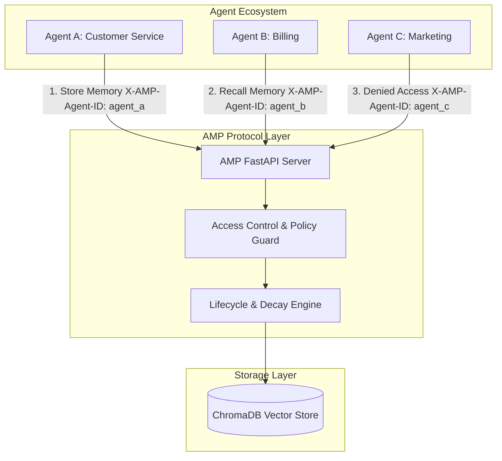

# AMP — Agent Memory Protocol

**An open protocol for AI agent memory interoperability.**

Like MCP for tool calling — but for memory.

[](https://github.com/AMP-Protocol/amp)
[](https://pypi.org/project/amp-client/)
[](LICENSE)
[](../SPEC.md)

---

## What is AMP?

AMP (Agent Memory Protocol) is an open, HTTP-native protocol for storing, retrieving, and sharing structured memory between AI agents across frameworks, vendors, and sessions. 

With AMP, agents can read and write to a shared memory tier using a standardized **Memory Cell** schema. It handles built-in access control, semantic search, and automatic decay-archival lifecycles out of the box.

---

## See It In Action (Multi-Agent Sharing)

Here is a running console demo from `examples/multi-agent-demo/run_demo.py` showing two agents sharing memory context while a third unauthorized agent is blocked:

```text
$ python examples/multi-agent-demo/run_demo.py

[AGENT A]
CustomerServiceAgent received: 'User prefers email correspondence.'
Stored preference memory ID: mem_01J0X1F8N93M4P6Q8R0S1T3V5

[AGENT B]
BillingAgent assisted user: user_123
Retrieved response: "I will make sure to send all future billing communications and invoices to your email address, as per your preference."

[AGENT C]
MarketingAgent try_access results: 0 memories retrieved
Agent C retrieved 0 memories — access control working correctly

[SUMMARY]
AMP Demo complete. Two agents shared memory. One was blocked.
```

---

## Quick Start in 3 Steps

Start the server, install the SDK client, and run the multi-agent demo in less than 5 minutes.

### Step 1: Install the SDK Client
```bash
pip install amp-client
```

### Step 2: Start the AMP Server
You can run the reference server with Docker:
```bash
cd server
docker compose up -d
```
*Or run locally with Uvicorn:*
```bash
cd server
pip install -e .
uvicorn amp_server.main:app --host 127.0.0.1 --port 8765
```

### Step 3: Run the Multi-Agent Demo
Run the demo script to verify everything is wired up:
```bash
cd examples/multi-agent-demo
pip install -r requirements.txt
python run_demo.py
```

---

## Comparison

| Feature | **AMP (Agent Memory Protocol)** | Raw HTTP + Vector DB | LangChain ConversationMemory | MCP (Model Context Protocol) |
|---|---|---|---|---|
| **Primary Focus** | AI agent long-term memory | Generic document/data search | Conversational chat history | Tool execution / state sharing |
| **Open Standard Schema** | Yes (`MemoryCell` model) | No (ad-hoc document formats) | No (custom data classes) | No (focused on tool descriptions) |
| **Lifecycle & Decay** | Yes (automatic state-machine decay) | No (requires custom code/cron) | No (requires manual management) | No |
| **Per-Cell Access Policy** | Yes (built-in access control ACLs) | No (enforced at database layer) | No | No |
| **Cross-Agent Sharing** | Yes (built-in out of the box) | No (requires custom middleware) | No (locked to single session/graph) | No |
| **Client Type** | Multi-client SDK (`amp-client`) | Custom db drivers | Framework-locked memory classes | Protocol-native client/server |

---

## System Architecture



---

## Protocol Specification

AMP is a schema-first protocol. The complete specifications detailing core schemas, decay mathematical models, state machines, and endpoint signatures can be found in [../SPEC.md](../SPEC.md).

For more detailed guides and client references:
- **Getting Started Guide**: [docs/getting-started.md](docs/getting-started.md)
- **Protocol Specification Explained**: [docs/spec-explained.md](docs/spec-explained.md)
- **API Reference**: [docs/api-reference.md](docs/api-reference.md)
- **FAQ**: [docs/faq.md](docs/faq.md)
- **Contributing Guide**: [.github/CONTRIBUTING.md](.github/CONTRIBUTING.md)
- **Code Examples**: [examples/](examples/)

---

## License

AMP is open source and available under the [MIT License](LICENSE).
