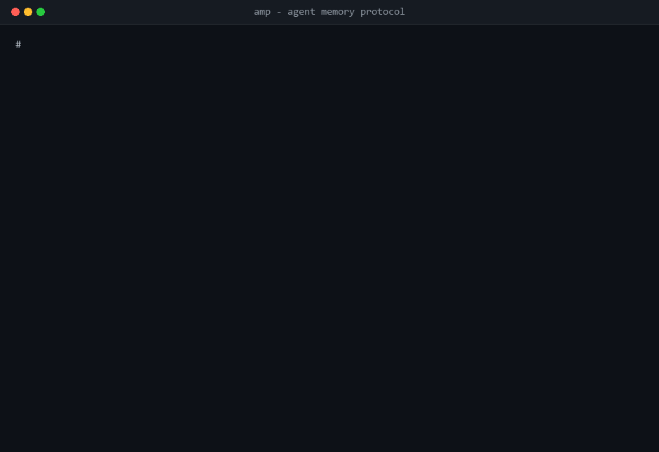
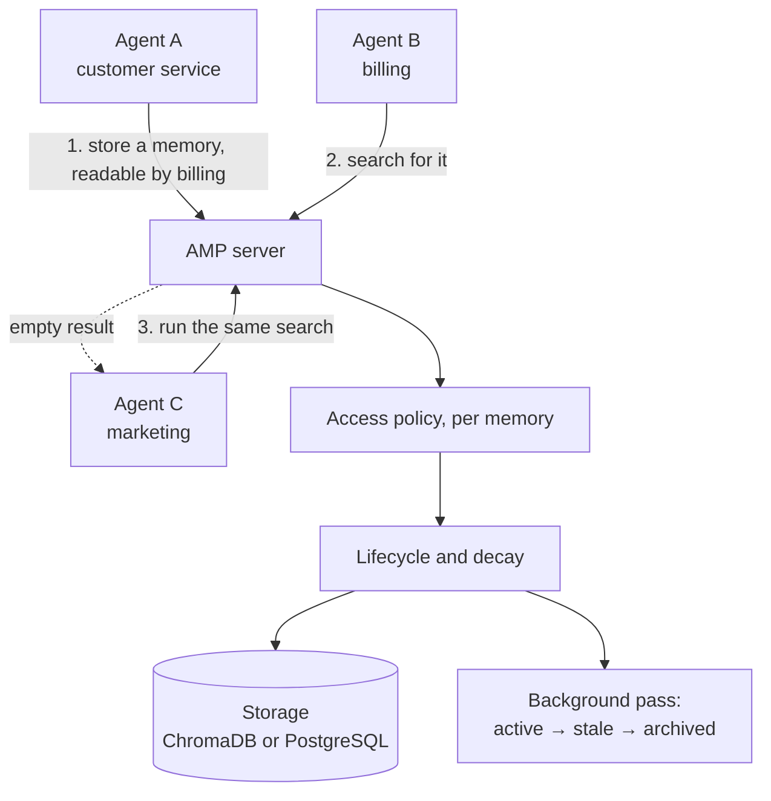

# AMP — Agent Memory Protocol

**AI agents forget everything between sessions. AMP is a shared memory they can all use — with rules about who is allowed to read what, and memories that fade when they stop being useful.**

It is an open protocol, not a product: a JSON schema for a memory, an HTTP API, a
reference server you run yourself, client SDKs, and a test suite you can point at
your own implementation.

Like MCP, but for memory instead of tools.

[](https://github.com/glatinone/agent-memory-protocol/actions/workflows/ci.yml)
[](https://glatinone.github.io/agent-memory-protocol/)
[](LICENSE)
[](spec/v0.1.0/memory-cell.schema.json)

**📖 Documentation: [glatinone.github.io/agent-memory-protocol](https://glatinone.github.io/agent-memory-protocol/)** — the getting started guide, the API reference, and a plain-English walkthrough of the spec.



*Real output from a real server, not a mock-up: `examples/multi-agent-demo` plus two
`curl` calls. [How this animation is made](scripts/README.md) — and how to re-record it.*

---

## The problem, in plain words

Every AI agent starts each session with no memory of the last one. The usual
workarounds are to paste notes into the prompt, or to let each framework keep its
own private store. Both break down the moment more than one agent is involved:
there is no shared place to put a fact, no way to say *this agent may read this and
that one may not*, and no way for an old fact to stop being repeated forever.

AMP is the shared notebook:

- **A memory is a small JSON document** — the text, who it is about, who may read
  and write it, how important it is, where it came from.
- **Any agent can use it, whatever framework it is built on.** One schema, over
  HTTP, with a Python and a Node client provided.
- **Access is per memory, not per database.** `readable_by` / `writable_by` say
  which agents may see and change each one, with wildcards for families of agents.
- **Memories fade on purpose.** A score built from importance and age moves a
  memory from `active` to `stale` to `archived`, so recall stays about what still
  matters instead of growing forever.
- **Deleting is honest.** A deleted memory disappears from search immediately and
  is then kept, unreadable, for a 30-day window before it can be erased for good —
  which is what an audit and an accidental deletion both need.

---

## See it run

No account, no service, nothing to sign up for.

```bash
# 1. run the reference server
cd server && docker compose up -d
# no Docker? docs/getting-started.md has the two-line plain-python path

# 2. run the demo the animation above shows
cd examples/multi-agent-demo && pip install -r requirements.txt && python run_demo.py
```

Then ask the same question as an agent that **may** read the memory, and as one
that may not:

```bash
# allowed: the memory was shared with agent_billing_*
curl -s http://localhost:8765/amp/v1/memories/search \
  -H 'X-AMP-Agent-ID: agent_billing_v1' -H 'Content-Type: application/json' \
  -d '{"query": "contact preference", "owner_id": "user_123", "limit": 3}'
# -> {"results":[{"content":{"text":"User prefers email correspondence."}}],"returned":1,...}

# refused: the same query, from an agent the memory was not shared with
curl -s http://localhost:8765/amp/v1/memories/search \
  -H 'X-AMP-Agent-ID: agent_marketing' -H 'Content-Type: application/json' \
  -d '{"query": "contact preference", "owner_id": "user_123", "limit": 3}'
# -> {"results":[],"returned":0,...}
```

The refusal is the point: no error to catch, no hint that the memory exists. An
error saying "forbidden" would let a caller probe for memories it may not see.

From code, the same thing:

```python
from amp_client import AMPClient

client = AMPClient("http://localhost:8765", agent_id="agent_billing_v1")
client.remember("User prefers email correspondence.", owner_id="user_123")
for cell in client.recall("how does the user want to be contacted?", owner_id="user_123"):
    print(cell["content"]["text"])
```

Install a client:

```bash
pip install amp-client              # Python: sync, async, and LangChain
npm install @glatinone/amp-client   # Node 18+, zero dependencies
```

Developing on the SDKs themselves? `pip install -e sdk/`, or work in `sdk/node/` directly.

---

## What is in the box

| Piece | What it is | Where |
|---|---|---|
| **Specification** | The `MemoryCell` schema, the decay formula, the lifecycle state machine, the threat model | [`spec/v0.1.0/`](spec/v0.1.0/) · [explained in plain English](docs/spec-explained.md) |
| **Reference server** | FastAPI, with your choice of storage: embedded ChromaDB, or PostgreSQL + `pgvector`. Includes an MCP server, so an LLM client can use memory as tools | [`server/`](server/) · [API reference](docs/api-reference.md) |
| **Client SDKs** | Python (sync, async, LangChain) and Node (zero dependencies) | [`sdk/`](sdk/) |
| **Conformance suite** | 39 checks to run against your own implementation. It imports nothing from this repo's server, so it judges your implementation rather than comparing it to ours | [`conformance/`](conformance/) |
| **OpenAPI contract** | Generated from the server and committed, so an API change shows up as a reviewable diff | [`spec/v0.1.0/openapi.json`](spec/v0.1.0/openapi.json) |

Implementing AMP yourself? `amp-conformance --base-url http://your-server` is the
fastest way to know where you stand — one of its categories checks you against the
numbers **your own** server advertises at `GET /spec`.

---

## How it works


```mermaid
graph TD
    A[Agent A<br/>customer service] -- "1. store a memory, readable by billing" --> S[AMP server]
    B[Agent B<br/>billing] -- "2. search for it" --> S
    C[Agent C<br/>marketing] -- "3. run the same search" --> S

    S --> P[Access policy, per memory]
    P --> D[Lifecycle and decay]
    D --> V[(Storage<br/>ChromaDB or PostgreSQL)]
    D --> L[Background pass:<br/>active → stale → archived]

    S -.->|"empty result"| C
```

An agent identifies itself with a header (`X-AMP-Agent-ID`) and every read and write
is checked against that memory's own policy. Anything an agent may not read is
simply absent from its results.

---

## Why not just a vector database?

| | **AMP** | Raw HTTP + vector DB | Framework memory | MCP |
|---|---|---|---|---|
| **Built for** | agent long-term memory | document search | one chat's history | tools and state |
| **Open schema** | yes, `MemoryCell` | no, ad-hoc | no, framework classes | no |
| **Lifecycle and decay** | yes, built in | you write the cron job | manual | no |
| **Per-memory access rules** | yes | at the database layer | no | no |
| **Sharing between agents** | yes | custom middleware | locked to one session | no |
| **Clients** | Python and Node | whatever you write | framework-locked | protocol-native |

---

## Where to go next

- **[Documentation site](https://glatinone.github.io/agent-memory-protocol/)** — everything below, rendered
- **[Getting started](docs/getting-started.md)** — server, SDK, embedding provider, storage backend, API keys
- **[API reference](docs/api-reference.md)** — every endpoint, plus the error contract
- **[Performance](docs/performance.md)** — measured storage and search numbers, and the two limits behind them
- **[Spec, explained](docs/spec-explained.md)** — the schema and the decay formula without the formal notation
- **[FAQ](docs/faq.md)** — including [how decay works in plain English](docs/faq.md#how-does-decay-work-in-plain-english)
- **[Release notes](docs/release-notes-v0.1.0.md)** — what is in this version, and what is not
- **[Conformance suite](conformance/README.md)** — for people implementing AMP themselves
- **[Contributing](.github/CONTRIBUTING.md)** — including the rule that every test file must pass on its own
- **[Security](SECURITY.md)** — how to report a problem, and what is in scope
- **[Examples](examples/)** — multi-agent demo, MCP config for Claude Desktop, quickstart

---

## Honest limits

Worth reading before you build on this:

- **The SDKs are published**: `pip install amp-client` and
  `npm install @glatinone/amp-client`, both at 0.1.0. The same artifacts are also attached
  to [the v0.1.0 release](https://github.com/glatinone/agent-memory-protocol/releases/tag/v0.1.0).
- **There is no hosted service.** You run the server. That is deliberate: your
  memory stays yours while the protocol gets tested.
- **Authentication is opt-in, and keys only.** By default the server trusts the
  agent-id header — fine on a network you control, not on the open internet. Set
  `AMP_API_KEYS_FILE` and a key becomes required; there are no scopes, expiry or
  rotation yet.
- **The MCP binding is one agent per server** unless you set `AMP_MCP_AGENT_ID`, so
  run one per agent if you want per-agent rules to mean anything.
- **The decay pass and the scoring-edit budget are per process.** Two servers over
  one database keep two of each.
- **Search cost grows with collection size, not page size.** Both backends rank the
  whole candidate set so a decay-weighted re-rank has something to re-rank, and the
  access filter cannot be pushed into either store. [Measured numbers and how to
  reproduce them](docs/performance.md).
- **PostgreSQL support is proven in CI, not on every machine.** The machine this was
  developed on has no PostgreSQL, so the storage contract suite runs against a real
  `pgvector` container in CI and skips locally.

277 server tests, 34 Python SDK tests plus 10 more against a real server, 24 Node tests and 39 conformance vectors run
in CI across Python 3.11/3.12 and Node 18/20/22, with lint, format and type gates on
every package.

---

## License

MIT — see [LICENSE](LICENSE).
