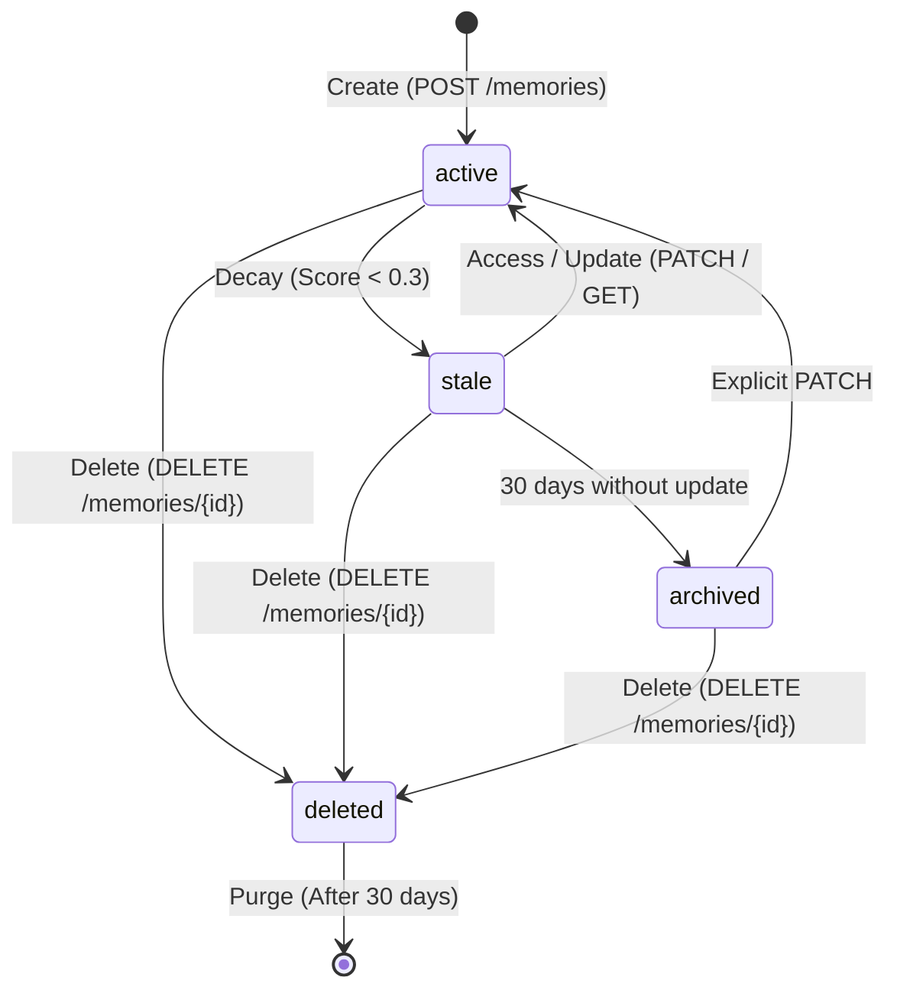

# Protocol Specification Explained

The Agent Memory Protocol (AMP) is an open, standardized protocol that defines how artificial intelligence agents store, search, and manage their long-term memory. 

This document explains the core architectural and conceptual elements of the AMP specification.

---

## 1. The MemoryCell

The atomic unit of storage in AMP is the **`MemoryCell`**. Every individual memory — whether a fact, a conversation reference, or a learned procedure — is represented as a single `MemoryCell` with a strict JSON structure.

### Anatomy of a MemoryCell

A `MemoryCell` consists of several structured sections:

*   **`id`**: A unique, sortable, time-based identifier (ULID) assigned by the server upon creation.
*   **`amp_version`**: The protocol version of the cell (e.g., `"0.1.0"`).
*   **`type`**: The cognitive category of the memory (see [Memory Types](#2-memory-types)).
*   **`content`**: The actual data stored:
    *   `text`: The primary natural language content.
    *   `metadata`: Arbitrary key-value pairs used for filtering or application-specific attributes.
*   **`identity`**: Contextual owners and creators:
    *   `owner_id`: Unique identifier of the entity (e.g., user, agent, organization) this memory concerns.
    *   `owner_type`: The category of owner (`"user" | "agent" | "organization"`).
    *   `created_by`: The ID of the agent or system that created the cell.
    *   `session_id`: Optional identifier linking the memory to a specific session.
*   **`scoring`**: Quantitative attributes used for retrieval ranking and lifecycle management:
    *   `importance`: The intrinsic value or severity of the memory (`0.0` to `1.0`).
    *   `confidence`: The certainty of the memory extraction (`0.0` to `1.0`).
    *   `decay_rate`: A coefficient indicating how quickly the memory decays.
    *   `access_count`: A counter indicating how many times the cell has been retrieved.
*   **`lifecycle`**: State machine attributes:
    *   `created_at`: UTC timestamp of creation.
    *   `last_accessed_at`: UTC timestamp of the last read operation.
    *   `last_updated_at`: UTC timestamp of the last write/patch operation.
    *   `expires_at`: Optional explicit expiration time.
    *   `status`: The current lifecycle status (`"active" | "stale" | "archived" | "deleted"`).
*   **`access_policy`**: Access control rules (`readable_by`, `writable_by`, and `public`).
*   **`provenance`**: The origin of the memory (`source_type`, `source_ref`, `extraction_method`).

---

## 2. Memory Types

AMP organizes memory into three distinct categories based on cognitive science taxonomy:

| Memory Type | Description | Example |
| :--- | :--- | :--- |
| **`episodic`** | Specific events, experiences, or conversational moments bound to a particular point in time. | "The user complained about a timeout in connection-4 on Tuesday." |
| **`semantic`** | De-contextualized facts, preferences, and general knowledge about the owner or environment. | "The user prefers Python for backend development." |
| **`procedural`** | Action-oriented instructions, learned workflows, and conditional rules. | "To deploy a service, check unit test health first, then build the container." |

When querying or searching, agents can filter by specific types to ensure they retrieve only relevant cognitive contexts (e.g., ignoring conversation logs when querying semantic preferences).

---

## 3. Lifecycle State Machine & Decay

To prevent memory bloat and ensure agents stay focused on relevant information, AMP uses a **Lifecycle State Machine**. Memories move through statuses automatically based on their usage and a mathematical decay model.

### The Decay Formula

At the heart of the lifecycle engine is a continuous exponential decay model. The current decay score of a memory cell is calculated as:

$$\text{decay\_score} = \text{importance} \times \text{confidence} \times e^{-\text{decay\_rate} \times \Delta t_{\text{days}}}$$

Where:
*   $\text{importance}$: The cell's intrinsic importance score $[0, 1]$.
*   $\text{confidence}$: The extraction confidence score $[0, 1]$.
*   $\text{decay\_rate}$: The rate of decay per day (default is `0.01`).
*   $\Delta t_{\text{days}}$: The number of days elapsed since the memory was created or last updated/accessed.

### Status Transitions

1.  **`active`**: The starting state. The cell is fully searchable and accessible.
2.  **`stale`**: When the `decay_score` falls **below `0.3`**, the cell automatically transitions to `stale`. Stale memories are excluded from default search queries unless explicitly requested. Reading or updating a stale memory resets its clock and transitions it back to `active`.
3.  **`archived`**: If a memory remains in the `stale` state for **30 consecutive days** without any access or update, the lifecycle engine automatically transitions it to `archived` (cold storage).
4.  **`deleted`**: A soft-deleted state triggered by a `DELETE` request. The cell is hidden from searches and standard reads.

---

## 4. Access Control Model

AMP implements a granular, agent-based access control system to secure memory cells. It regulates actions using the `X-AMP-Agent-ID` header, which identifies the agent making the request.

Access policies are defined inside the `access_policy` object of each memory cell:

*   **`public` (boolean)**: If set to `true`, any agent can read the memory cell.
*   **`readable_by` (list of strings)**: A list of agent IDs or patterns allowed to retrieve or search the cell.
*   **`writable_by` (list of strings)**: A list of agent IDs or patterns allowed to update or delete the cell.

### Wildcard Matching
Both `readable_by` and `writable_by` support wildcard (`*`) matching. For example, setting `"readable_by": ["agent-team-*"]` grants read permissions to `agent-team-1`, `agent-team-dev`, etc.

### Owner and Creator Bypass
To prevent agents from locking themselves out of their own data, AMP features built-in bypasses:
*   The **`identity.owner_id`** (if it represents an agent) always bypasses access policies and has full read/write access.
*   The **`identity.created_by`** agent always bypasses access policies and has full read/write access.

---

## 5. GDPR Compliance & Right to Erasure

As AI systems process personal user data, complying with privacy frameworks is vital. AMP is designed to support **GDPR Article 17 (Right to Erasure)** compliance out-of-the-box:

*   **Soft Deletes**: Triggering a `DELETE` on a memory cell immediately changes its status to `"deleted"`. In this state, it is omitted from all semantic searches and normal retrieval requests, ensuring the agent immediately "forgets" the information.
*   **Retention Window**: Soft-deleted memories are kept in a tombstones state for a **30-day retention window**. This allows for accidental deletion recovery and auditability.
*   **Hard Purges**: After the 30-day window expires, the server's background cleanup worker permanently purges (hard-deletes) the records from the physical database, fulfilling the right to erasure.
